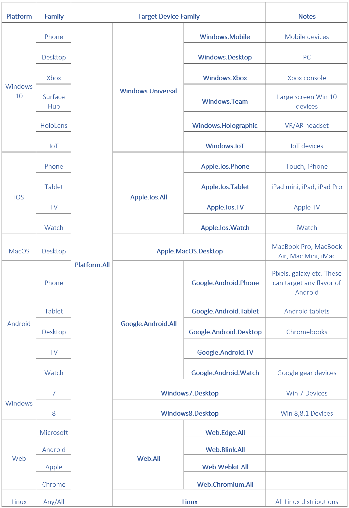

#MSIX Packaging SDK
   Copyright (c) 2017 Microsoft Corp.  All rights reserved.

## Build a package to target the SDK 

The MSIX Packaging SDK offers developers a universal way to distribute package contents to client devices regardless of the OS platform on the client device. This enables developers to package their app content once instead of having to package for each platform. 

To take advantage of the new SDK and the ability to distribute your package contents to multiple platforms, we are providing a way to specify the target platforms where you want your packages to extract to. This means, the app developers can ensure that the package contents are being extracted from the package only as desired. 

The following table shows the target device families to declare in the manifest:




## Sample Manifest File(AppxManifest.xml)

```xml
<?xml version="1.0" encoding="utf-8"?>
<Package xmlns="http://schemas.microsoft.com/appx/manifest/foundation/windows10"
         xmlns:uap3="http://schemas.microsoft.com/appx/manifest/uap/windows10/3">

  <Identity Name="awesome.BestApp"
            Publisher="Awesome Publisher"
            Version="1.0.0.0" />

    <Properties>
    <DisplayName>Best App</DisplayName>
    <PublisherDisplayName>Awesome Publisher</PublisherDisplayName>
    <Description>msix package</Description>
    <Logo>Assets\Logo.png</Logo>
  </Properties>

  <Dependencies>
      <TargetDeviceFamily Name="Platform.All" MinVersion="0.0.0.0" MaxVersionTested="0.0.0.0"/>
  </Dependencies>

  <Applications>
    <Application Id="e504fb41-a92a-4526-b101-542f357b7acb">
        <uap:VisualElements
            DisplayName="Best App" 
            BackgroundColor="white"
            Square150x150Logo="images\squareTile-sdk.png" 
            Square44x44Logo="images\smallTile-sdk.png" 
            AppListEntry="none">
        </uap:VisualElements>

        <Extensions>
            <uap3:Extension Category="Windows.appExtension">
                <uap3:AppExtension Name="add-in-contract" Id="add-in" PublicFolder="Public" DisplayName="Sample Add-in" Description="This is a sample add-in">
                    <uap3:Properties>
                        <!-- Free form space -->
                    </uap3:Properties>
                </uap3:AppExtension>
            </uap3:Extension>
        </Extensions>
        
    </Application>
  </Applications>

</Package>

```

If you would like to package the app in such a way that it works natively on Windows 10, here are the guidelines to follow:

### Manifest creation 
Manifest 


# Microsoft Bot Builder Overview

Microsoft Bot Builder is a powerful framework for constructing bots that can handle both freeform interactions and more guided ones where the possibilities are explicitly shown to the user. It is easy to use and leverages C# to provide a natural way to write Bots.

|                                      |                                 |
|--------------------------------------|---------------------------------|
| **msix**      | A shared library (DLL on Win32, dylib on MacOs, SO on Linux and Android) that exports a subset of the functionality contained within appxpackaging.dll on Windows. See [here](https://msdn.microsoft.com/en-us/library/windows/desktop/hh446766(v=vs.85).aspx) for additional details. On all platforms instead of CoCreating IAppxFactory, a c-style export: CoCreateAppxFactory is provided.  See sample folder at root of package for cross platform consumption examples.                <br /><br /> Finally, there is one export 'Unpack' that provides an simplified unpackage implementation.|
| **makemsix**  | A command line wrapper over the Unpack implementation.  This tool exists primarily as a means of validating the implementation of the MSIX Packaging SDK internal routines and is compiled for Win32, MacOS, and Linux platforms.|


High Level Features:
* Powerful dialog system with dialogs that are isolated and composable.  
* Built-in dialogs for simple things like Yes/No, strings, numbers, enumerations.  
* Built-in dialogs that utilize powerful AI frameworks like [LUIS](http://luis.ai)
* Bots are stateless which helps them scale.  
* Form Flow for automatically generating a Bot from a C# class for filling in the class and that supports help, navigation, clarification and confirmation.

[Get started with the Bot Builder!](http://docs.botframework.com/sdkreference/csharp/)

The code itself uses Nuget which restores all needed files when built.  If you want to build the documentation, 
you will need to install [Doxygen](http://www.stack.nl/~dimitri/doxygen/), [GraphViz](http://graphviz.org/) and [Mscgen](http://www.mcternan.me.uk/mscgen/)
Here are step by step instructions:

1. Download and install from the [Doxygen Windows Installer](http://ftp.stack.nl/pub/users/dimitri/doxygen-1.8.11-setup.exe).
2. Download and install from the [GraphViz Windows Installer](http://graphviz.org/pub/graphviz/stable/windows/graphviz-2.38.msi)
3. Download and install from the [Mscgen Windows Installer](http://www.mcternan.me.uk/mscgen/software/mscgen_0.20.exe)

If versions have changed you can find the latest through the core pages above, although you may need to update the Doxygen config file with the appropriate version of tools.

If you want to do localization you should also install the [Multilingual App Toolkit](https://developer.microsoft.com/en-us/windows/develop/multilingual-app-toolkit) which
allows you to edit the localization files and make use of tools like automatic translation.
