# MSIX Packaging Extension

The *MSIX Packaging* Extension is an Azure DevOps extension which helps build, package and sign Windows apps using the MSIX package format.

CI/CD workflows have become an integral part of the development process to improve efficiency and quality while reducing cost and time to market. Microsoft's CI/CD solution Azure DevOps Pipelines is widely adopted and popular, but the current process of integrating build and deployment workflows for apps that need to be packaged as MSIX into Azure Pipelines by using YAML files is tedious, specifically for people that are not Azure Pipelines or MSIX experts. This Azure DevOps extension offers a straightforward, intuitive and UI based solution making it easier to automate build and deployment process for apps being packaged as MSIX, and for apps with existing CI/CD workflows to move to MSIX without disrupting their build and deployment mechanisms.

The *MSIX Packaging* Extension contains the following tasks that you can use to custom build your pipeline according to your requirements:

1. **MSIX build and package** - to build and package Windows apps using the MSIX package format
2. **MSIX package signing** - to sign MSIX packages using a trusted certificate
3. **App installer file for MSIX** - to create or update a .appinstaller file for MSIX apps
4. **Create package for MSIX app attach** - to create a VHDX package for MSIX app attach

## Install the extension

Browse the Azure DevOps Marketplace and look for the extension name *MSIX Packaging* Extension.

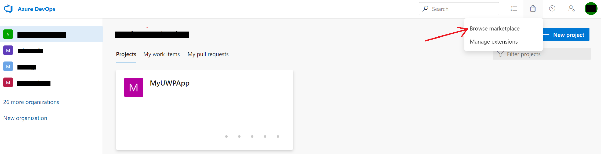

## Create a Pipeline

Create a new pipeline for your Azure DevOps project.

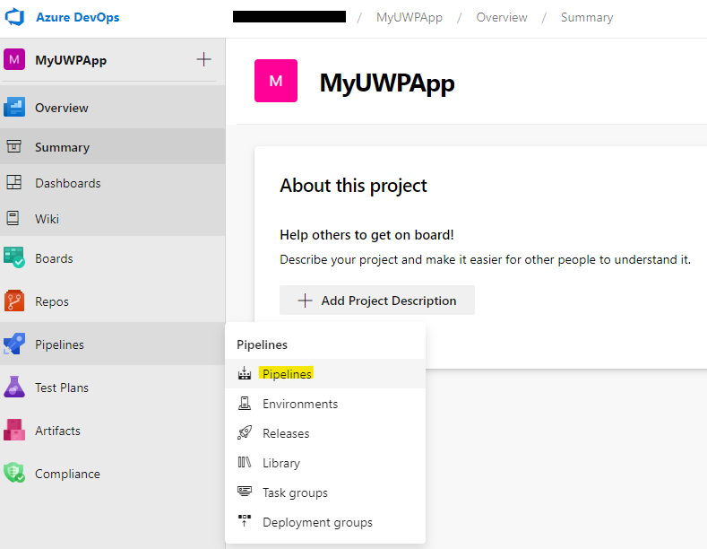

Select the option to *Use the classic editor to create a pipeline without YAML*.

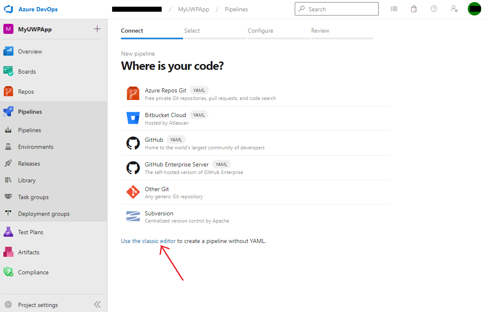

Select your version control system and provide your repository and default branch details.

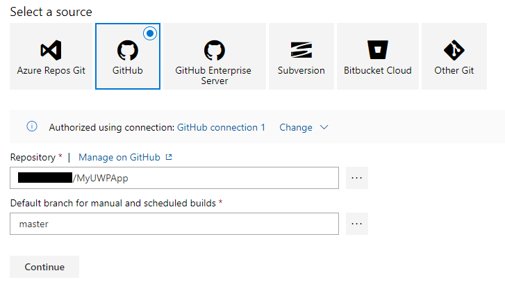

When asked to *Select a template*, click *start with an **Empty job***.

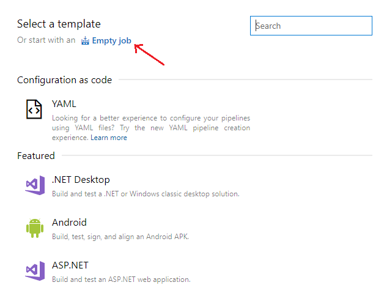

Change your *Agent Specification* selection to ***windows-2019*** since the MSIX extension runs only on a Windows agent.

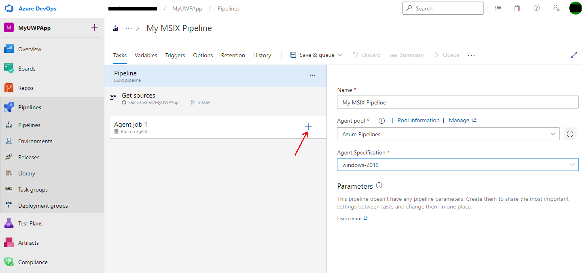

You should see *Agent job 1* by default in your pipeline. Click on the plus symbol to *Add a task to Agent job 1*.

Search for ***MSIX*** in the *Add tasks* search bar and you should see the tasks mentioned before in the *MSIX Packaging* Extension. You can custom build your pipeline by adding the tasks you need according to your requirements. But we will demonstrate how to configure all four tasks on this page.

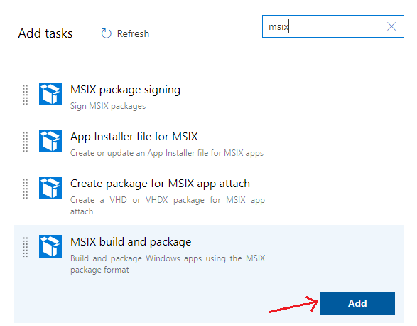

### MSIX build and package

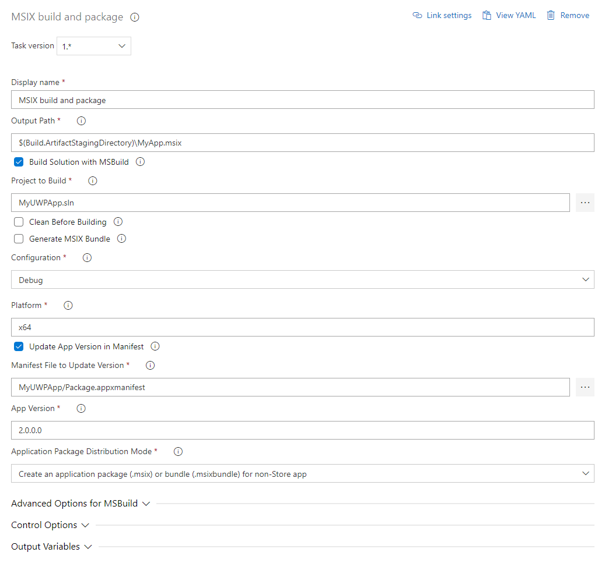

- **Display name** - Customize your task name
- **Output Path** - Specify the output path for the MSIX package that will be created by this task. The path in the example above uses [predefined variable](https://docs.microsoft.com/azure/devops/pipelines/build/variables) **Build.ArtifactStagingDirectory** which is the local path on the agent to store artifacts, and is used here to store task output files which can later be published using a publish artifacts task.
- **Build Solution with MSBuild** - Select this option to build your solution with msbuild for the specified target platform. Leave the box unchecked if you already have binaries that just need to be packaged. If you leave the box unchecked, you will be asked to provide the path to your binaries.
- **Project to Build** - Provide the path to your project or solution file that needs to be built.
- **Clean before Building** - Select this checkbox if you want the task to run a clean build prior to the build.
- **Generate MSIX Bundle** - Select this checkbox to generate an MSIX bundle instead of a package. Make sure to name your output file in the **Output Path** option with a .msixbundle extension instead of .msix.
- **Configuration** - Choose between *Debug* and *Release* build configurations.
- **Platform** - Specify the target build platform, for example, *x64*, *x86*, *Any CPU*.
- **Update App Version in Manifest** - Select this checkbox to change the app version from the one specified in the app's .appxmanifest file. This will not overwrite the .appxmanifest file, but change the app version in the generated output MSIX package. If this option is selected, you will be asked to provide the path to the manifest file, and the app version number to set for the app.
- **Application Package Distribution Mode** - Select the mode from the dropdown menu to generate a Store app package or non-Store app package.
- **Advanced Options for MSBuild** - Customize your MSBuild by using advanced options.

### MSIX package signing

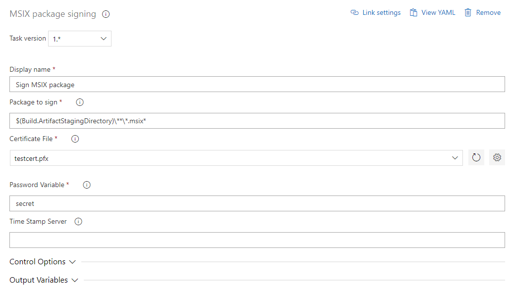

- **Display name** - Customize your task name
- **Package to sign** - The MSIX package signing task uses SignTool to sign all files matching this path, regardless of whether they are MSIX packages or bundles.
- **Certificate file** - Select your trusted certificate to sign the app from the dropdown, or upload a certificate file by using the gear icon.
- **Password Variable** - The name of the variable which stores the password used to access the certificate file for signing. Note that this is NOT the password itself, but rather the variable name, which can be set under Library.
- **Time Stamp Server** - A URL that specifies the address of a time stamping server. This is an optional parameter.

### App installer file for MSIX

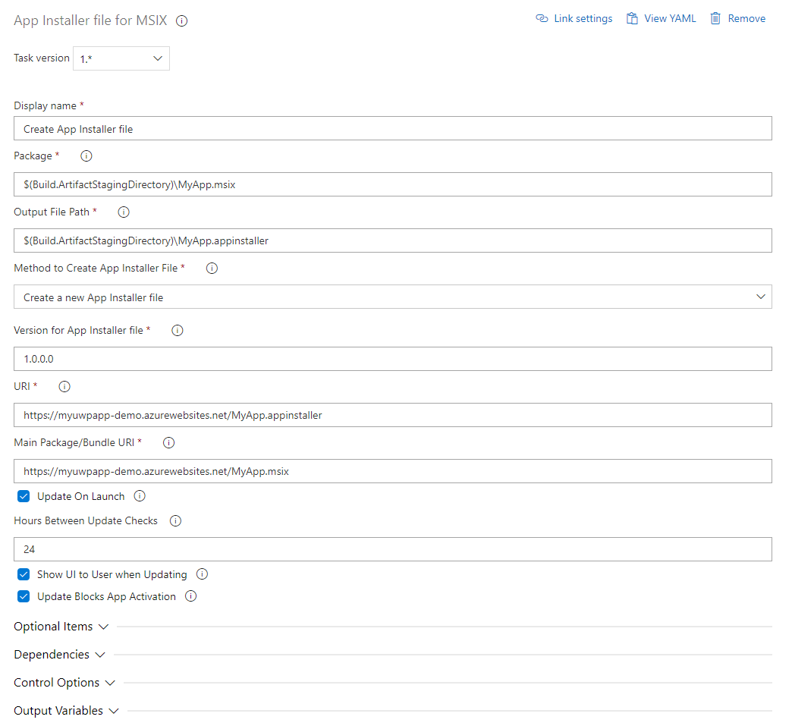

- **Display name** - Customize your task name
- **Package** - This is the path to the package or bundle you want to create an App Installer for.
- **Output File Path** - This is the path of the App Installer file to be written.
- **Method to Create App Installer File** - Choose whether to create a new App Installer file or update an existing one. If you choose to update an existing one, you will be asked to provide the path to the existing App Installer file.
- **Version for App Installer file** - The version number which will be given. Must take the form (*major*).(*minor*).(*build*).(*revision*).
- **URI** - Web URI to the redirected App Installer file.
- **Main Package/Bundle URI** - URI to the app package/bundle location.
- **Update On Launch** - Select this to set the app to check for updates when launched. If this checkbox is selected, you will be asked to provide details like *Hours Between Update Checks*, whether to *Show UI to User when Updating*, and whether you want the *Update to Block App Activation*.

### Create package for MSIX app attach

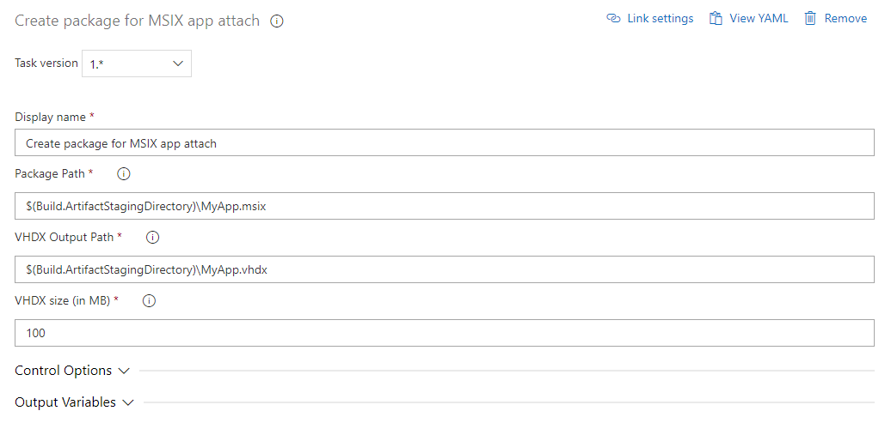

- **Display name** - Customize your task name.
- **Package Path** - This is the path to the MSIX package/bundle.
- **VHDX Output Path** - This is the path of the VHDX file that will be created by the task.
- **VHDX size** - The maximum size in MBs of the VHDX.

After configuring all the tasks, you can use a *Publish build artifacts* task to drop all the artifacts from the temp location to Azure Pipelines artifacts or a file share of your choice.

## Ways to provide Feedback

We would love to hear your feedback on the *MSIX Packaging* Extension. Reach out to us via the following channels:

- Review the extension on Azure DevOps Marketplace
- [MSIX Tech Community](https://techcommunity.microsoft.com/t5/msix/ct-p/MSIX)
- [GitHub open source project](https://github.com/microsoft/msix-packaging/tree/master/tools/pipelines-tasks) - The source code for this extension is a part of the MSIX SDK open source project, which welcomes contributions and suggestions.
